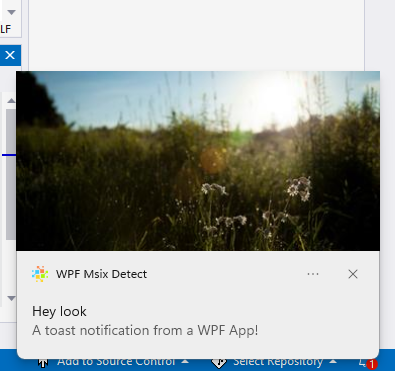

# Sample: Detect if app is running in an MSIX Container

Many Windows developers are transitioning from packaging their apps with MSI to [MSIX](https://aka.ms/msix). The simplified installed process, automatic updates and increased app security are a few reasons why developers are making this change.

## Applications in transition to MSIX

While developers are transitioning to MSIX app packaging, in many cases they will need to support both MSI and MSIX app deployment. 

Developers may want to take advantage of Windows APIs that are only supported when running in an MSIX container. Also devs may want to hide UI - like menus that **Update the app** since this is not needed for MSIX deployed apps since apps can be automatically updated.

## Toast notifications from WPF

Toast notifications require that the app run in an MSIX container.

This sample demonstrates how to detect if the app is running in a MSIX container and enables UI to display a toast notification.

## Detecting if running in an MSIX container 

If running in an MSIX container, the app will have a package name. Use Win32 [GetCurrentPackageFullName](https://docs.microsoft.com/en-us/windows/win32/api/appmodel/nf-appmodel-getcurrentpackagefullname) API to determine if app has package name. Alternatively, you can call the Windows Runtime API [Package.Current](https://docs.microsoft.com/en-us/uwp/api/windows.applicationmodel.package.current). This API throws an exception if the app does not have a package.

## .NET 5 and 6 and Windows Runtime.

This samples uses the .NET Target Framework Moniker (TFM) ```net6.0-windows10.0.19041.0```. This will pull in the necessary dependencies to call Windows Runtime APIs.

Here is a toast notification displayed form the app:



